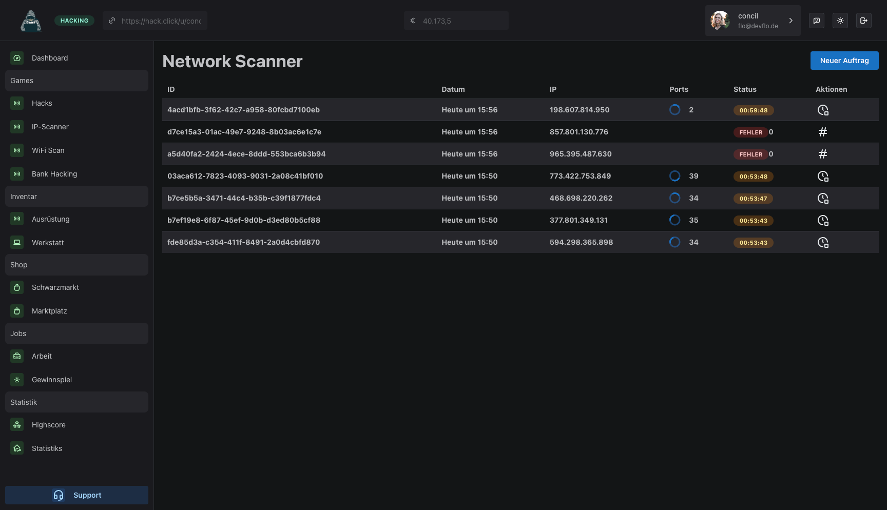

## Welcome to the Hilarious Click-Hacker Game!

Hey there, tech enthusiasts and gaming aficionados! Get ready to dive into the wacky world of the **Hilarious Click-Hacker Game** – a side project that's brimming with a touch of Mantine.dev and a sprinkle of Deepkit.io. 🚀

### What's the Buzz All About?

This quirky online game is a work-in-progress gem that's been unleashed into the digital wild for all to enjoy (and chuckle at). It's a testament to my tinkering with React and Node.js, a sandbox where creativity meets fun. But remember, it's a bit like an unfinished puzzle – intriguing but not entirely complete.

### How Does the Game Roll?

In this entertaining escapade, you'll find yourself in a click frenzy! The goal is simple: amass points by sharing your unique game link far and wide. Each click on your link brings you closer to digital glory! But that's not all – keep an eye out for the marketplace, where you can concoct your very own Virtual Computer. The possibilities are as endless as they are hilarious!

### Behind the Scenes Magic

The gears and cogs of this whimsical game are powered by Deepkit and Deepkit RPC on the API side. Curious about Deepkit? Dive into their world at [https://deepkit.io](https://deepkit.io). On the frontend, the enchanting visuals and smooth interactions are brought to life using the delightful [Mantine](https://mantine.dev) framework.

### Join the Shenanigans!

Are you ready to embrace the absurdity and spread the joy? Feel free to tinker with this project, put your own twist on it, or simply have a good laugh. The game's code is a reflection of my journey in the realms of React and Node.js, so don your virtual hacker hat and explore!

Remember, it's all in good fun – so share your high scores, your craziest virtual computers, and your thoughts on making this game even more hilariously awesome.

Let the clicking begin! 🎮🕹️
